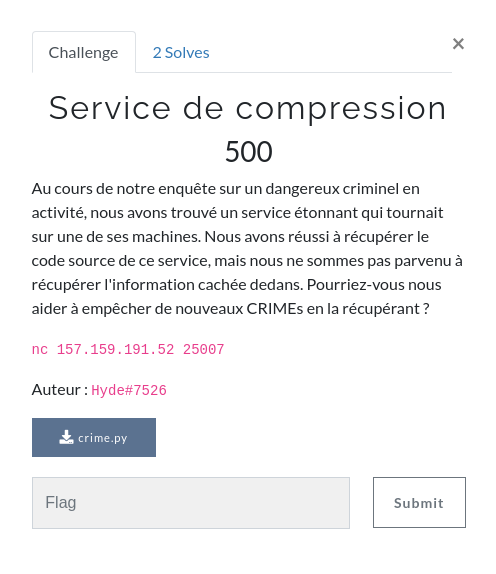
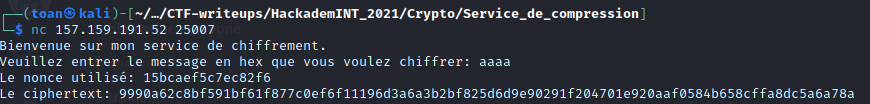

# Service de compression writeup




There is a netcat server to connect to and a  file attached to the chall description : 
```python3
from Crypto.Cipher import ChaCha20
from os import urandom
import zlib
from secret import flag


def compress(message):
    return zlib.compress(message)

def encrypt(plaintext):
    secret = os.urandom(32)
    cipher = ChaCha20.new(key=secret)
    return cipher.nonce + cipher.encrypt(plaintext)


def main(connection):
    p=urandom(1) #Byte aléatoire pour empecher des attaques simples
    print("Bienvenue sur mon service de chiffrement.")
    while True:
        inp=input("Veuillez entrer le message en hex que vous voulez chiffrer: ")
        try:
            message=bytes.fromhex(inp)
        except:
            print("Erreur dans la réception de votre message, merci de recommencer")
            continue
        compressed_text = compress(p + flag + message)
        encrypted = encrypt(compressed_text)

        nonce = encrypted [:8]
        ciphertext = encrypted [8:]
        print("Le nonce utilisé: " + nonce.hex())
        print("Le ciphertext: " + ciphertext.hex())

```




This program uses the ChaCha20 stream cipher to encrypt the zlib compression of a plaintext given by the user along with a random byte and the flag.

Since it uses compression, any strings that repeats itself will be stored only once. Also, the program uses a stream cipher without any kind of padding so the length of the ciphertext becomes a valuable information. Finally, the ```CRIME``` in the chall description refers to the  security exploit.


I solved this chall with the following Python script:
```python3
from pwn import *

def send(r, hex_message):
	r.sendline(hex_message)
	r.recv()
	return r.recv().decode().split('\n')[1].replace("Le ciphertext: ", '')

r = remote("157.159.191.52" ,25007)
print(r.recv())
flag = b"HackademINT{".hex()

l = 92 # length of the ciphertext

while b'}' not in bytes.fromhex(flag):
	for i in range(128):
		y = hex(i)[2:].zfill(2)
		ciphertext = send(r, flag + y)
		# print(ciphertext)
		if len(ciphertext) == 92:
			flag += y
			print("Found letter :", y, bytes.fromhex(y))
			break
	print("Current flag =", bytes.fromhex(flag))
print("Flag =", bytes.fromhex(flag))
```

Flag = ***HackademINT{Cr1m35_4nd_Pun1shm3n75}***