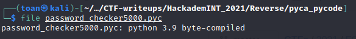
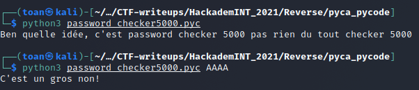
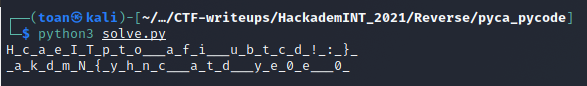

# Pyca Pycode writeup 


There is a [password_checker.pyc](password_checker5000.pyc) file attached to the challenge.

A quick ```file``` combined with the ```.pyc``` extension lets us know that this is a Python 3.9 bytecode file.



By playing around with the program we understand it requires one password argument and checks whether the pass is correct or not.



Knowing this, my first idea was to try using `uncompyle6` to retrieve the equivalent source code. Unfortunately, `uncompyle6` only accepts bytecodes from Python version 1.0 to version 3.8 at the time of writing. 


Okay so we will have to disassemble the bytecode then. We can accomplish this by using the ```dis``` and ```marshal``` libraries.

```python3
import dis, marshal

with open("password_checker5000.pyc", "rb") as f:
    metadata = f.read(16) # The pyc header size for Python 3.9 is 16 bytes
    code = marshal.load(f)

dis.dis(code)
```

And we get the following :

```
  1           0 LOAD_CONST               0 (0)
              2 LOAD_CONST               1 (None)
              4 IMPORT_NAME              0 (sys)
              6 STORE_NAME               0 (sys)

  2           8 LOAD_CONST               0 (0)
             10 LOAD_CONST               2 (('b32decode',))
             12 IMPORT_NAME              1 (base64)
             14 IMPORT_FROM              2 (b32decode)
             16 STORE_NAME               2 (b32decode)
             18 POP_TOP

  5          20 LOAD_NAME                3 (__name__)
             22 LOAD_CONST               3 ('__main__')
             24 COMPARE_OP               2 (==)
             26 EXTENDED_ARG             1
             28 POP_JUMP_IF_FALSE      262

  6          30 LOAD_NAME                4 (len)
             32 LOAD_NAME                0 (sys)
             34 LOAD_ATTR                5 (argv)
             36 CALL_FUNCTION            1
             38 LOAD_CONST               4 (2)
             40 COMPARE_OP               3 (!=)
             42 POP_JUMP_IF_FALSE       62

  7          44 LOAD_NAME                6 (print)
             46 LOAD_CONST               5 ("Ben quelle idée, c'est password checker 5000 pas rien du tout checker 5000")
             48 CALL_FUNCTION            1
             50 POP_TOP

  9          52 LOAD_NAME                0 (sys)
             54 LOAD_METHOD              7 (exit)
             56 LOAD_CONST               6 (1)
             58 CALL_METHOD              1
             60 POP_TOP

 11     >>   62 LOAD_NAME                0 (sys)
             64 LOAD_ATTR                5 (argv)
             66 LOAD_CONST               6 (1)
             68 BINARY_SUBSCR
             70 LOAD_METHOD              8 (encode)
             72 LOAD_CONST               7 ('utf-8')
             74 CALL_METHOD              1
             76 STORE_NAME               9 (key)

 12          78 LOAD_CONST               8 (b'')
             80 STORE_NAME              10 (final_key)

 13          82 LOAD_NAME               11 (enumerate)
             84 LOAD_NAME                9 (key)
             86 LOAD_CONST               1 (None)
             88 LOAD_CONST               1 (None)
             90 LOAD_CONST               4 (2)
             92 BUILD_SLICE              3
             94 BINARY_SUBSCR
             96 CALL_FUNCTION            1
             98 GET_ITER
        >>  100 FOR_ITER                34 (to 136)
            102 UNPACK_SEQUENCE          2
            104 STORE_NAME              12 (i)
            106 STORE_NAME              13 (j)

 14         108 LOAD_NAME               10 (final_key)
            110 LOAD_NAME               14 (bytes)
            112 LOAD_NAME               13 (j)
            114 LOAD_CONST               9 (53)
            116 BINARY_ADD
            118 LOAD_NAME               12 (i)
            120 BINARY_SUBTRACT
            122 LOAD_CONST              10 (256)
            124 BINARY_MODULO
            126 BUILD_LIST               1
            128 CALL_FUNCTION            1
            130 INPLACE_ADD
            132 STORE_NAME              10 (final_key)
            134 JUMP_ABSOLUTE          100

 15     >>  136 LOAD_NAME               10 (final_key)
            138 LOAD_CONST               8 (b'')
            140 LOAD_METHOD             15 (join)
            142 LOAD_NAME               16 (map)
            144 LOAD_CONST              11 (<code object <lambda> at 0x7ff01d7a39d0, file "main.py", line 15>)
            146 LOAD_CONST              12 ('<lambda>')
            148 MAKE_FUNCTION            0
            150 LOAD_NAME                9 (key)
            152 LOAD_CONST              13 (-2)
            154 LOAD_CONST               1 (None)
            156 LOAD_CONST              13 (-2)
            158 BUILD_SLICE              3
            160 BINARY_SUBSCR
            162 CALL_FUNCTION            2
            164 CALL_METHOD              1
            166 INPLACE_ADD
            168 STORE_NAME              10 (final_key)

 17         170 LOAD_CONST              14 (b' \x15\x17\x1b\x12^JB>9#U\t\x16\x01\x1c\x1a\x0c:M\x020\x0bN\x1e\x15+\x07\x1d`\x14D3)\n\x1d1#\x18\n\x17b4')
            172 STORE_NAME              17 (passphrase)

 20         174 BUILD_LIST               0
            176 STORE_NAME              18 (xored)

 21         178 LOAD_NAME               19 (zip)
            180 LOAD_NAME               10 (final_key)
            182 LOAD_NAME               17 (passphrase)
            184 CALL_FUNCTION            2
            186 GET_ITER
        >>  188 FOR_ITER                22 (to 212)
            190 UNPACK_SEQUENCE          2
            192 STORE_NAME              12 (i)
            194 STORE_NAME              13 (j)

 22         196 LOAD_NAME               18 (xored)
            198 LOAD_METHOD             20 (append)
            200 LOAD_NAME               12 (i)
            202 LOAD_NAME               13 (j)
            204 BINARY_XOR
            206 CALL_METHOD              1
            208 POP_TOP
            210 JUMP_ABSOLUTE          188

 24     >>  212 LOAD_CONST              15 (b'LWBIHDDI3LK6BIVSV7CZXEM5SSBYXPIOLGWZWUZRQUCGYACMJBTS4ACAEVNFF4SNHMRRO===')
            214 STORE_NAME              21 (hashed)

 25         216 LOAD_NAME               14 (bytes)
            218 LOAD_NAME               18 (xored)
            220 CALL_FUNCTION            1
            222 LOAD_NAME                2 (b32decode)
            224 LOAD_NAME               21 (hashed)
            226 CALL_FUNCTION            1
            228 COMPARE_OP               2 (==)
            230 POP_JUMP_IF_FALSE      254

 26         232 LOAD_NAME                6 (print)
            234 LOAD_CONST              16 ("Eh bah gg, le flag c'est bien : {}")
            236 LOAD_METHOD             22 (format)
            238 LOAD_NAME                0 (sys)
            240 LOAD_ATTR                5 (argv)
            242 LOAD_CONST               6 (1)
            244 BINARY_SUBSCR
            246 CALL_METHOD              1
            248 CALL_FUNCTION            1
            250 POP_TOP
            252 JUMP_FORWARD             8 (to 262)

 28     >>  254 LOAD_NAME                6 (print)
            256 LOAD_CONST              17 ("C'est un gros non!")
            258 CALL_FUNCTION            1
            260 POP_TOP
        >>  262 LOAD_CONST               1 (None)
            264 RETURN_VALUE

Disassembly of <code object <lambda> at 0x7ff01d7a39d0, file "main.py", line 15>:
 15           0 LOAD_GLOBAL              0 (bytes)
              2 LOAD_FAST                0 (a)
              4 LOAD_CONST               1 (3)
              6 BINARY_MULTIPLY
              8 LOAD_CONST               2 (256)
             10 BINARY_MODULO
             12 BUILD_LIST               1
             14 CALL_FUNCTION            1
             16 RETURN_VALUE
```

Thankfully, the disassembled python bytecode is pretty straightforward and lets us write back the original program:

```python3
from base64 import b32decode
import sys

if __name__ == '__main__':
	if sys.argv != 2:
		print("Ben quelle idée, c'est password checker 5000 pas rien du tout checker 5000")
		sys.exit(1)
	else:
		key = sys.argv[1].encode('utf-8')
		final_key = b''
		for i, j in enumerate(key[::2]):
			final_key += bytes([(j + 53 - i) % 256])
		final_key += b''.join(map(lambda a: bytes([a*3 % 256]), key[::-2]))
		passphrase = b' \x15\x17\x1b\x12^JB>9#U\t\x16\x01\x1c\x1a\x0c:M\x020\x0bN\x1e\x15+\x07\x1d`\x14D3)\n\x1d1#\x18\n\x17b4'
		xored = []
		for i, j in zip(final_key, passphrase):
			xored.append(i ^ j)
		hashed = b'LWBIHDDI3LK6BIVSV7CZXEM5SSBYXPIOLGWZWUZRQUCGYACMJBTS4ACAEVNFF4SNHMRRO==='
		if bytes(xored) == b32decode(hashed):
			print("Eh bah gg, le flag c'est bien : {}".format(sys.argv[1]))
		else:
			print("C'est un gros non!")

```

In order to get the flag, we need to have :
final_key XOR passphrase = b32decode(hashed) 
=> final_key = passphrase XOR b32decode(hashed)

```python3
>>> from base64 import b32decode
>>> from Crypto.Util.strxor import strxor
>>> passphrase = b' \x15\x17\x1b\x12^JB>9#U\t\x16\x01\x1c\x1a\x0c:M\x020\x0bN\x1e\x15+\x07\x1d`\x14D3)\n\x1d1#\x18\n\x17b4'
>>> hashed = b'LWBIHDDI3LK6BIVSV7CZXEM5SSBYXPIOLGWZWUZRQUCGYACMJBTS4ACAEVNFF4SNHMRRO==='
>>> strxor(passphrase, b32decode(hashed))
b'}\x97\x94\x97z\x84\x9f\xa2\x9c\x8b\x8c\x90\x92\x87\x9c\x88\x99\x87\x87C[\x9d\x90\x1d/\x90/k\x1d,\\#\x1d)J8kq\xeaG,A#'
```


The only thing left to do is to reverse the creation process of the final key: 

```python3
final_key = b'}\x97\x94\x97z\x84\x9f\xa2\x9c\x8b\x8c\x90\x92\x87\x9c\x88\x99\x87\x87C[\x9d\x90\x1d/\x90/k\x1d,\\#\x1d)J8kq\xeaG,A#'


for i, j in enumerate(final_key[:len(final_key)//2+1]):
	print(chr((j-53+i) % 256), end='_')

print()

print('_', end='')
for c in final_key[len(final_key)//2+1:][::-1]:
	m = chr((c+256)//3)
	if ord(m) > 127:
		m = chr(c//3)
	print(m, end='_')
```




Let's reassemble the strings and we get our flag : ***HackademINT{python_ca_fait_du_bytec0de!_:0}***
